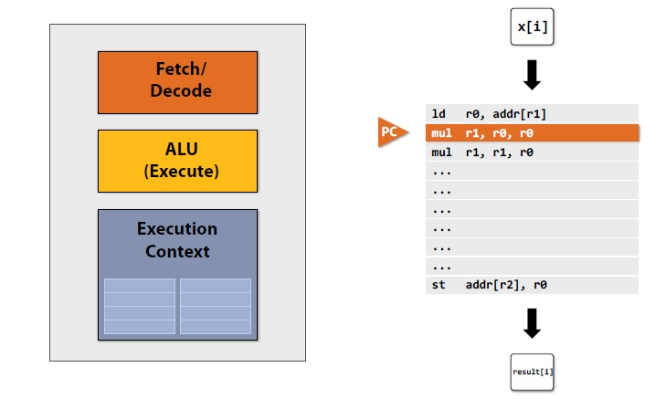
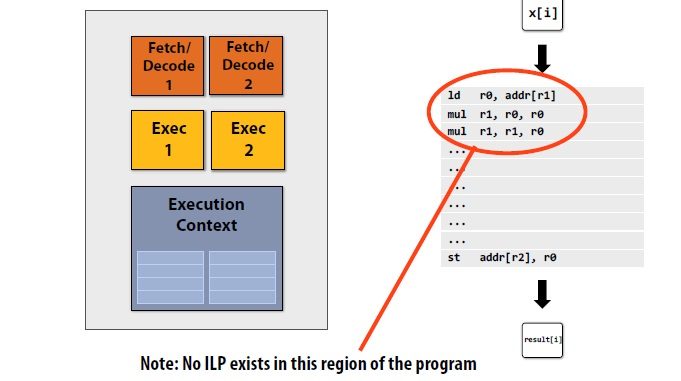
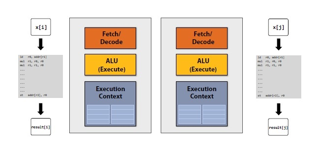
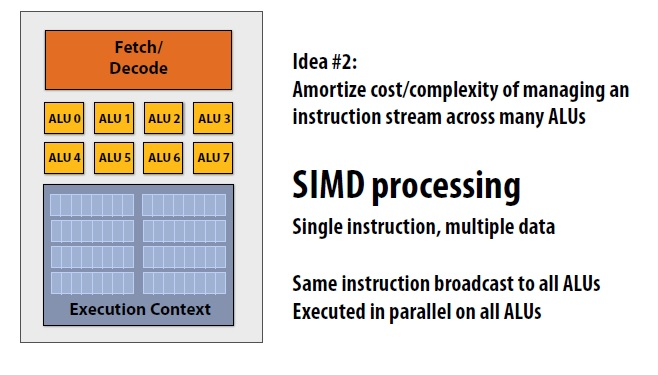

# Lecture 2 A Modern Multi-Core Processor
- 理解并行计算的形式
- 理解延迟(latency)和带宽(bandwidth)

## parallel execution

### 单线程执行
例程:使用泰勒公式计算$sin(x)$。
```C++
void sinx(int N,int terms, float* x,float* result){
    for(int i=0;i<N;i++){
        float value = x[i];
        float numer = x[i] * x[i] *x[i];
        int denom = 6;
        int sign = -1;

        for(int j=1;j<= terms;j++){
            value += sign * numer / denom;
            numer *= x[i] * x[i];
            denom *= (2*j+2)*(2*j+3);
            sign *= -1;
        }

        result[i]=value;
    }
}
```





- 解码模块(Fetch/Decode)读取指令
- ALU模块负责执行
- 上下文存储器(Exceution Context)负责存储执行数据

### 多线程执行

概念：指令级并行 instruction level parallelism (ILP)






例程：
```C++
typedef struct{
    int N;
    int terms;
    float *x;
    float result;
} my_args;

void parallel_sinx(int N,int terms, float* x,float* result){
    pthread_t thread_id;
    my_args args;

    args.N=2/N;
    args.terms=terms;
    args.x=x;
    args.result=result;

    pthread_create(&thread_id, NULL, my_thread_start, &args);//launch thread
    sinx(N-args.N,terms,x+args.N,result+args.N);
    pthread_join(thread_id, NULL);
}

void sinx(int N,int terms, float* x,float* result){
    for(int i=0;i<N;i++){
        float value = x[i];
        float numer = x[i] * x[i] *x[i];
        int denom = 6;
        int sign = -1;

        for(int j=1;j<= terms;j++){
            value += sign * numer / denom;
            numer *= x[i] * x[i];
            denom *= (2*j+2)*(2*j+3);
            sign *= -1;
        }

        result[i]=value;
    }
}
```
上述例程表示线程级并行的代码描述，通过将整个工作分散分配到不同的处理器核中，以获得加速的效果。工作的分配方式将很大程度上影响加速的效果。

### 数据并行




概念：SMID 单指令多数据处理


使用AVX指令集的代码如下：
```C++
#include <immintrin.h>
void sinx(int N, int terms, float* x, float* sinx)
{
    float three_fact = 6; // 3!
    for (int i=0; i<N; i+=8)
    {
        __m256 origx = _mm256_load_ps(&x[i]);
        __m256 value = origx;
        __m256 numer = _mm256_mul_ps(origx, _mm256_mul_ps(origx, origx));
        __m256 denom = _mm256_broadcast_ss(&three_fact);
        int sign = -1;
        for (int j=1; j<=terms; j++)
        {
            // value += sign * numer / denom
            __m256 tmp = _mm256_div_ps(_mm256_mul_ps(_mm256_broadcast_ss(sign),numer),denom);
            value = _mm256_add_ps(value, tmp);
            numer = _mm256_mul_ps(numer, _mm256_mul_ps(origx, origx));
            denom = _mm256_mul_ps(denom, _mm256_broadcast_ss((2*j+2) * (2*j+3)));
            sign *= -1;
        }
        _mm256_store_ps(&sinx[i], value);
    }
}
```
按照上图所示CPU模型，通过使用SMID单个核可以一次指令同时处理8个数据，达到并行处理数据的效果。

另一种自动优化代码的写法，前提是循环loop之间相互独立

```C++
void sinx(int N, int terms, float* x, float* result)
{
    // declare independent loop iterations
    forall (int i from 0 to N-1)
    {
        float value = x[i];
        float numer = x[i] * x[i] * x[i];
        int denom = 6; // 3!
        int sign = -1;
        for (int j=1; j<=terms; j++)
        {
            value += sign * numer / denom
            numer *= x[i] * x[i];
            denom *= (2*j+2) * (2*j+3);
            sign *= -1;
        }
        result[i] = value;
    }
}
```