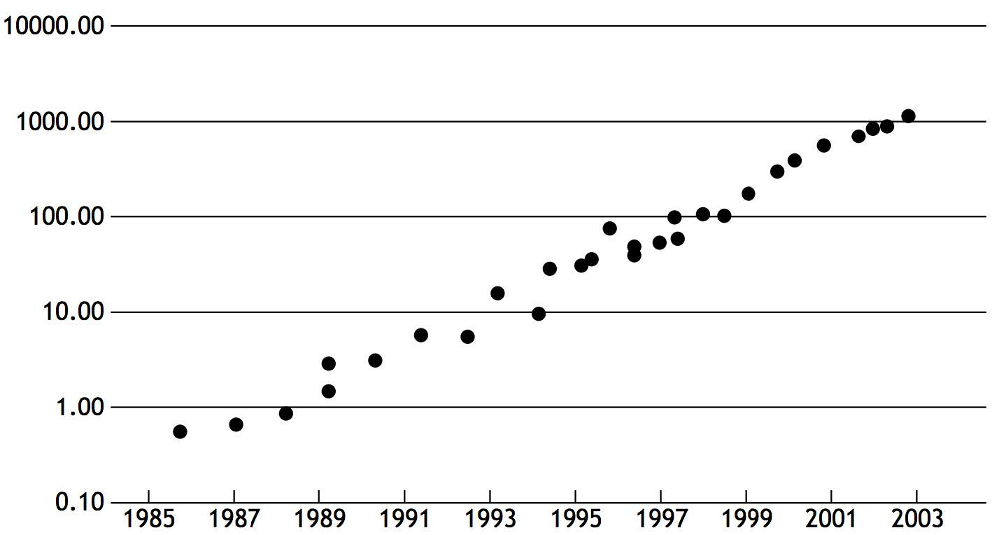
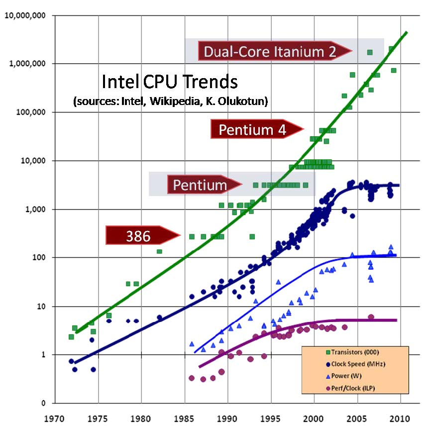
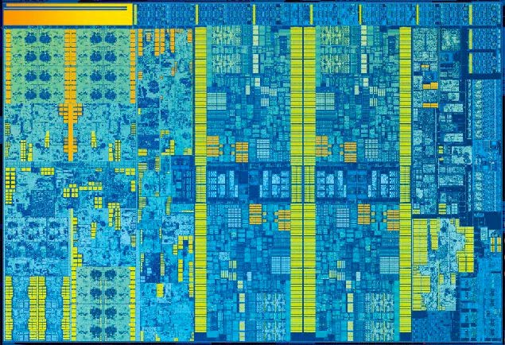

课程地址：http://www.cs.cmu.edu/afs/cs/academic/class/15418-f18/www/schedule.html

# Lecture 1
## 为什么需要并行计算？

单核CPU的性能几乎成指数级增长，而且英特尔在2004已经到达了单核的功耗墙。









在2004年之前想要让程序变得更快，买一个新的机器

但是2004年之后，需要进行并行编程。

## 目前的CPU架构





最左边的是GPU，右边排列了4块CPU，中间是通讯总线。可见现代CPU都是采用多核设计，以达到更快的速度。

## 什么是并行计算？

A parallel computer is a collection of processing elements
that cooperate to solve problems quickly。

并行计算器，就是协调多个单核处理器以解决问题。

加速比

$$ speedup(using \quad P \quad processors) = \frac{execution \quad time(using \quad 1 \quad processors)}{execution \quad time (using \quad P \quad processors)} $$

并行计算的原则
- 交流信息严重限制了加速比
- 不平衡的工作分配会限制加速比