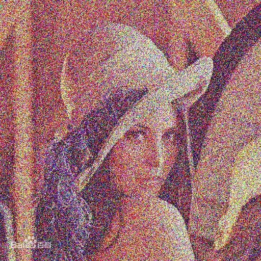
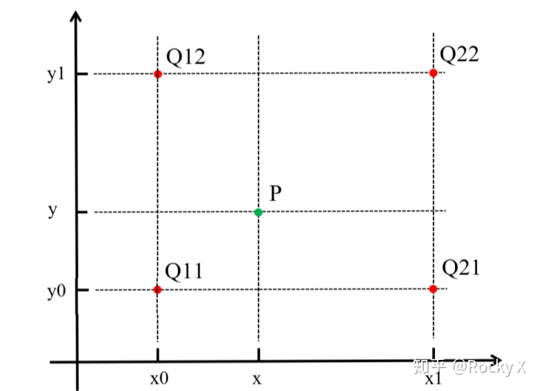

本系列是参考[冈萨雷斯《数字图像处理》](https://baike.baidu.com/item/%E6%95%B0%E5%AD%97%E5%9B%BE%E5%83%8F%E5%A4%84%E7%90%86%EF%BC%88%E7%AC%AC%E4%B8%89%E7%89%88%EF%BC%89)与[斯坦福CS131课程](http://vision.stanford.edu/teaching/cs131_fall2021/index.html)进行自我总结而成的数字图像处理基础知识。

# 数字图像表示
## 数学形式定义
令$f(s,t)$表示连续图像函数，通过采样和量化可以将这幅连续图像转化成数字图像$f(x,y)$，该图像有$M$行$N$列，其中$f(x,y)$是离散坐标，函数$f(x,y)$的值表示灰度值。

计算集为了方便存储和处理通常将图像表示成矩阵形式，形式如下
$$ A=\left[
 \begin{matrix}
   a_{0,0} & a_{0,1} & \cdots & a_{0,N-1} \\
   a_{1,0} & a_{1,1} & \cdots & a_{1,N-1} \\
   \vdots & \vdots & \ddots & \vdots \\
   a_{M-1,0} & a_{M-1,1} & \cdots & a_{M-1,N-1}
  \end{matrix}
  \right] \tag{1}
$$

许多图像显示器都是从左上角开始向右移动，每次扫描一行。习惯上将左上角作为矩阵的第一个元，这也符合笛卡尔坐标系。

$f(x,y)$函数的值$L$离散化后，通常称为灰度级数，一般取2的整数倍
$$ L=2^{k} \tag{2}$$
$L$的取值在$[0,L-1]$区间内，这个区域称作动态范围。

一幅数字图像存储所需要的比特数$b$可以表示为

$$b=MNk \tag{3} $$
## 饱和度、噪声与对比度
### 饱和度

饱和度是指一个最大值，超过该值的所有灰度值都会被裁掉，图像显示则显示显示器所能显示的最大亮度

### 噪声

图像噪声是指存在于图像数据中的不必要的或多余的干扰信息。





#### 对比度与反差比

对比度是指图像中最高和最低灰度级间的灰度差，反差比则是它们之间的比率

## 空间分辨率和灰度分辨率

### 空间分辨率

空间分辨率的单位是点数$dpi$，越大说明图像显示的原本信息更细腻

### 灰度分辨率

灰度分辨率是指灰度级中可分辨的最小变化，一般采用8比特，也有使用16、32比特，但是不常见。注：在16级灰度或者跟小的灰度等级中，会出现伪轮廓，类似地图中的等高线。

# 图像内插

内插通常在图像放大、缩小、旋转和几何校正等任务中使用。内插在放大缩小中使用重采样的方法，内插是用已知数据来估计未知位置的值的过程。

## 最邻近插值法
将原图像中最邻近的灰度赋给每一个新位置。将目标图像中的点，对应到原图像中后，找到最相邻的整数坐标点的像素值，作为该点的像素值输出。





这种方法虽然简单，但是容易失真。

## 双线性内插

双线性内插使用4个最近的灰度来计算给定位置的灰度。令$(x,y)$表示待赋值的灰度值的位置，$v(x,y)$表示灰度值，公式如下：

$$ v(x,y) = ax+by +cxy + d \tag{4}$$

4个系数可有点$(x,y)$的四个最近的点写出四个未知方程求出。

## 双三次内插

双线性内插使用16个最近的灰度来计算给定位置的灰度。令$(x,y)$表示待赋值的灰度值的位置，$v(x,y)$表示灰度值，公式如下：

$$ v(x,y) = \sum_{i=0}^{3}\sum_{j=0}^{3}a_{ij}x^iy^j \tag{5}$$

16个系数可有点$(x,y)$的16个最近的点写出16个未知方程求出。它是Adobe商业公司使用的标准内插法。

## 区别

图像的精细程度：双三次内插法>双线性内插>最邻近插值法

# 像素的基本关系

参考：
作者：Lemon雷
链接：https://www.jianshu.com/p/2aef925ed39e
来源：简书

## 相邻的定义

两个像素连通的两个条件是：

1. 两个像素的位置是否相邻

2. 两个像素的灰度值是否满足特定的相似性准则（同时满足某种条件，比如在某个集合内或者相等）

我们令V是用于定义连通性的灰度值集合。比如V={x|0<x<125} (x是指像素点的灰度值)。那么：

### 4连通
对于灰度值在V集合中的像素p和q，如果q在p的4邻域中（即N4(p)），那么称像素p和q是4连通的





### 8连通
对于灰度值在V集合中的像素p和q，如果q在p的8邻域中（即N8(p)），那么称像素p和q是8连通的




### m连通（混合连通）
对于灰度值在V集合中的像素p和q，如果：

1. q在p的4邻域中，或者

2. q在p的D邻域中，并且p的4邻域与q的4邻域的交集是空的（即没有灰度值在V集合中的像素点）

那么称这两个像素是是m连通的，即4连通和D连通的混合连通。





注：m连通（混合连通）是8连通的改进版，这个概念的提出就是为了消除8连通的二义性

## 距离测度

### 欧几里得距离

$$ D_{e}^{(p,q)} = [ (x-u)^2 + (y-v)^2 ]^{\frac{1}{2}} $$

### D4距离

$$ D_{4}^{(p,q)} = |x-u|+|y-v| $$

### D8距离

$$ D_{8}^{(p,q)} = max(|x-u|,|y-v|) $$

# 加性图像降噪的数学原理

假设图像 $f(x,y)$ 是被加性噪声$\eta(x,y)$污染后的图像，也即
$$ g(x,y)= f(x,y) + \eta(x,y) \tag{6}$$
其中$\eta(x,y)$噪声在每个坐标上是不相关的，并且均值为0。

若图像噪声满足上述关系，可以证明对$K$幅图像进行平均得到：
$$ \bar{g}(x,y) = \frac{1}{K} \sum_{i=1}^K g_i(x,y) \tag{7}$$
$$ E\{\bar{g}(x,y)\} = f(x,y) \tag{8}$$
$$ \sigma_{\bar{g}(x,y)}^2 = \frac{1}{K} \sigma_{\eta(x,y)}^2 \tag{9}$$

可知当$K$逐渐变大时，图像的噪声水平越低。

下面为加入了高斯白噪声的图片





使用如上原理去除噪声后





图片来源：http://accu.cc/content/pil/agwn/

# 比较图像

## 相减方法

$$ g(x,y) = f(x,y) - h(x,y) \tag{10}$$
f(x,y)为模板图像，h(x,y)为摄影图像

## 阴影校正
假设g(x,y)为采样得到的图像，f(x,y)为理想图像，h(x,y)为阴影
$$ g(x,y) = f(x,y) h(x,y) \tag{11}$$
通过乘以h(x,y)的反函数，即可获得理想图像。

## 作用

可以用来校正阴影和获得ROI。

## 运算公式

$$ g_m = g - min(g) \tag{12}$$
$$ g_s = K [ g_m / max(g_m) ] \tag{13}$$

## 几何运算

仿射变换可以完成图像的缩放、旋转、平移或剪切变换
$$ 
 \left[
 \begin{matrix}
   x' \\
   y' \\
   1
  \end{matrix}
  \right]=T\left[
 \begin{matrix}
   x \\
   y \\
   1
  \end{matrix}
  \right]=
  \left[
 \begin{matrix}
   a_{1,1} & a_{1,2} & a_{1,3}  \\
   a_{2,1} & a_{2,2} & a_{2,3}  \\
   0 & 0 & 1
  \end{matrix}
  \right]\left[
 \begin{matrix}
   x \\
   y \\
   1
  \end{matrix}
  \right]
   \tag{14}
$$
### 典型的仿射变换矩阵
变换名称|仿射矩阵$T$|
---|:--:|---:
恒等|$\left[\begin{matrix}1 & 0 & 0  \\0 & 1 & 0  \\0 & 0 & 1\end{matrix}\right]$ |
缩入\反射|$\left[\begin{matrix}c_x & 0 & 0  \\0 & c_y & 0  \\0 & 0 & 1\end{matrix}\right]$ |
关于原点旋转|$\left[\begin{matrix}cos\theta & -sin\theta & 0  \\sin\theta & cos\theta & 0  \\0 & 0 & 1\end{matrix}\right]$ |
平移|$\left[\begin{matrix}1 & 0 & t_x  \\0 & 1 & t_y  \\0 & 0 & 1\end{matrix}\right]$ |
垂直剪切|$\left[\begin{matrix}1 & s_v & 0  \\0 & 1 & 0  \\0 & 0 & 1\end{matrix}\right]$ |
水平剪切|$\left[\begin{matrix}1 & 0 & 0  \\s_h & 1 & 0  \\0 & 0 & 1\end{matrix}\right]$ |

注意使用区分：前向映射和后向映射









