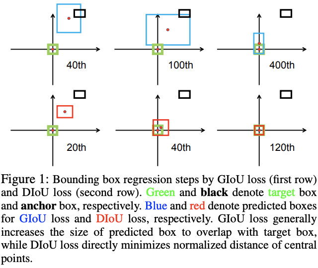
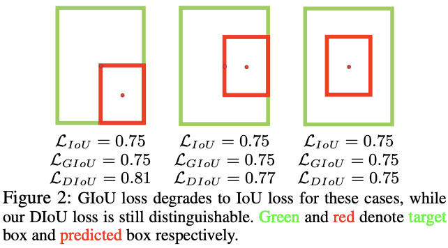
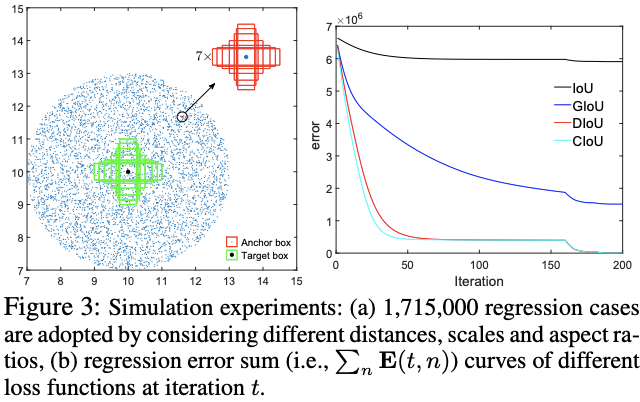
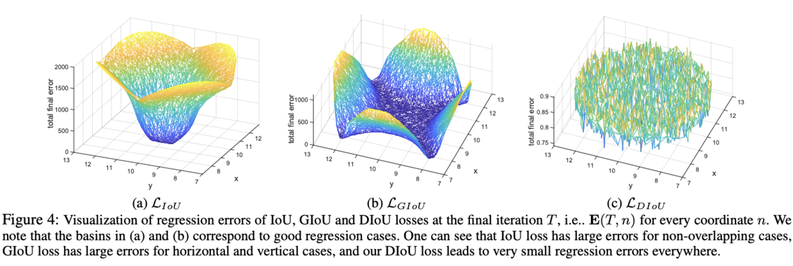

# Bounding Box 损失函数
## IOU
### 概述
IoU(Intersection over Union)，即交并比，是目标检测中常见的评价标准，主要是衡量模型生成的bounding box和ground truth box之间的重叠程度，计算公式为：

$$ IoU=\frac{DetectionResult \bigcap GroundTruth}{DectionResult \bigcup GroundTruth} \tag{1} $$




图片来源：https://zhuanlan.zhihu.com/p/60794316




图片来源：https://zhuanlan.zhihu.com/p/60794316

### 优缺点
优点
- 可以反映预测检测框与真实检测框的检测效果。
- 还有一个很好的特性就是尺度不变性，也就是对尺度不敏感（scale invariant）， regression任务中，判断predict box和gt的距离最直接的指标就是IoU。(满足非负性；同一性；对称性；三角不等性)


缺点
- 当两个box无交集时，IoU=0，很近的无交集框和很远的无交集框的输出一样，这样就失去了梯度方向，无法优化。
- IoU无法精确的反映两者的重合度大小。如下图所示，三种情况IoU都相等，但看得出来他们的重合度是不一样的，左边的图回归的效果最好，右边的最差。






### 计算方法

相交矩形坐标计算公式

$$ x_{contl} = max(xmin1,xmin2) $$
$$ y_{contl} = max(ymin1,ymin2) $$
$$ x_{conbr} = min(ymax1,ymax2) $$
$$ y_{conbr} = min(ymax1,ymax2) $$

IoU计算公式：


$$ area_{DetectionResult} = (xmax1 - xmin1 + 1) * (ymax1 - ymin1 + 1) $$
$$ area_{GroundTruth} = (xmax2 - xmin2 + 1) * (ymax2 - ymin2 + 1) $$
$$ area_{con} = max(0, x_{conbr} - x_{contl}) * max(0, y_{conbr} - y_{contl}) $$
$$ IoU = \frac{area_{con}}{area_{DetectionResult} + area_{GroundTruth} - area_{con}} \tag{2}$$

代码如下：

```python
import numpy as np
# ############################################################
# # IOU
# ############################################################
def two_Box_iou(list_a, list_b):
    """Compute the iou of two boxes.
    """
    # 获取矩形框交集对应的顶点坐标(intersection)
    xmin1, ymin1, xmax1, ymax1 = int(list_a[0]),int(list_a[1]), int(list_a[2]), int(list_a[3])
    xmin2, ymin2, xmax2, ymax2 = int(list_b[0]),int(list_b[1]), int(list_b[2]), int(list_b[3])
 
    xx1 = np.max([xmin1, xmin2])
    yy1 = np.max([ymin1, ymin2])
    xx2 = np.min([xmax1, xmax2])
    yy2 = np.min([ymax1, ymax2])
 
    # 计算两个矩形框面积
    area1 = (xmax1 - xmin1 + 1) * (ymax1 - ymin1 + 1)
    area2 = (xmax2 - xmin2 + 1) * (ymax2 - ymin2 + 1)
 
    # 计算交集面积
    inter_area = (np.max([0, xx2 - xx1])) * (np.max([0, yy2 - yy1]))
    # 计算交并比
    iou = inter_area / (area1 + area2 - inter_area + 1e-6)
    return iou
#
list_a = [321,296,387,342]
list_b = [328,313,359,332]
rst_IOU = two_Box_iou(list_a, list_b)
print(rst_IOU)
```

### 损失函数





IOU损失函数不易直接采用L2范数函数，通常将使用如下损失函数：

$$ L_{IoU} = 1-IoU \tag{3}$$

也有其他的变体如：UnitBox的交叉熵形式和IoUNet的Smooth-L1形式

## GIoU

来源：CVPR2019论文[Generalized Intersection over Union: A Metric and A Loss for Bounding Box Regression](https://arxiv.org/abs/1902.09630)通过对Loss的修改提升检测任务的效果。

### 概述

假如现在有两个任意性质 A，B，我们找到一个最小的封闭形状C（smallest convex shapes C），让C可以把A，B包含在内，然后我们计算C中没有覆盖A和B的面积占C总面积的比值，然后用A与B的IoU减去这个比值。

GIoU有如下性质：

- 与IoU类似，GIoU也可以作为一个距离，loss可以用 [公式3] 来计算
- 同原始IoU类似，GIoU对物体的大小不敏感
- GIoU总是小于等于IoU，对于IoU，有 $0\leq IoU \leq 1$ ,GIoU则是$-1 \leq GIoU \leq 1$ 。在两个形状完全重合时，有 $GIoU=IoU=1$
- 由于GIoU引入了包含A，B两个形状的C，所以当A，B不重合时，依然可以进行优化。

### 计算方法

公式如下：

$$ GIoU = IoU - \frac{|C-(A \bigcup B)|}{|C|}  \tag{4}$$
$$ = IoU - \frac{area_{C} - (area_{DetectionResult} + area_{GroundTruth} - area_{con})}{area_{C}} $$
其中
$$ x_{Ctl} = min(xmin1,xmin2) $$
$$ y_{Ctl} = min(ymin1,ymin2) $$
$$ x_{Cbr} = max(ymax1,ymax2) $$
$$ y_{Cbr} = max(ymax1,ymax2) $$
$$ area_{C} = max(0, x_{Cbr} - x_{Ctl}) * max(0, y_{Cbr} - y_{Ctl}) $$

### 损失函数

损失函数定义如下：

$$ L_{GIoU} = 1 - IoU + \frac{|C-(A \bigcup B)|}{|C|} \tag{5}$$

### 优缺点




如上图所示，在训练过程中，GIoU倾向于先增大bbox的大小来增大与GT的交集，然后通过[公式5]的IoU项引导最大化bbox的重叠区域。



GIoU会退化成IoU。

优点
- 克服了IoU的大部分缺点

缺点
- 由于很大程度依赖IoU项，GIoU需要更多的迭代次数来收敛，特别是水平和垂直的bbox。一般地，GIoU loss不能很好地收敛SOTA算法，反而造成不好的结果。
- 这里论文主要讨论的类似YOLO的检测网络，按照GT是否在cell判断当前bbox是否需要回归，所以可能存在无交集的情况。而一般的two stage网络，在bbox regress的时候都会卡$IoU\ge 0.5$，不会对无交集的框进行回归

## DIoU

论文:[Distance-IoU Loss: Faster and Better Learning for Bounding Box Regression](https://arxiv.org/abs/1911.08287)

### 概述

论文提出Distance-IoU(DIoU) loss，简单地在IoU loss基础上添加一个惩罚项，该惩罚项用于最小化两个bbox的中心点距离。如GIoU和DIoU优化过程图所示，DIoU收敛速度和效果都很好，而且DIoU能够用于NMS的计算中，不仅考虑了重叠区域，还考虑了中心点距离。另外，论文考虑bbox的三要素，重叠区域，中心点距离和长宽比，进一步提出了Complete IoU(CIoU) loss，收敛更快，效果更好。

### 计算方法





$$ R_{DIoU} = \frac{\rho^2(DetectionResult,GroundTruth)}{c^2} \tag{6}$$
$\rho(DetectionResult,GroundTruth)$表示框中心点坐标间的距离。

### 损失函数

$$ L_{DIoU} = 1 - IoU + R_{DIoU} $$
$$ L_{DIoU} = 1 - IoU + \frac{d^2}{c^2} \tag{7}$$

### 优缺点
优点
- 与GIoU loss 类似，DIoU loss 在与目标框不重叠时，仍然可以为边界框提供移动方向。
DIoU loss 可以直接最小化两个目标框的距离，因此比 GIoU  loss 收敛快得多。
- 对于包含两个框在水平方向和垂直方向上这种情况，DIoU loss 可以使回归非常快，而 GIoU loss 几乎退化为 IoU loss。
- DIoU 还可以替换普通的 IoU 评价策略，应用于 NMS 中，使得 NMS 得到的结果更加合理和有效。
同$L_{GIoU}$类似，$L_{DIoU}$的值域范围也为$L_{DIoU}\in [ 0,2)$。

## CIoU

### 概述
论文考虑到bbox回归三要素中的长宽比还没被考虑到计算中，因此，进一步在DIoU的基础上提出了CIoU。

### 计算方法

$$ R_{CIoU} = \frac{\rho^2(DetectionResult,GroundTruth)}{c^2} + \alpha v \tag{8}$$
$$ v=\frac{4}{\pi}(arctan\frac{w^{gt}}{h^{gt}} - arctan\frac{w}{h})^2 \tag{9}$$

其惩罚项如上述公式，其中$\alpha$是权重函数，而$v$用来度量长宽比的相似性

### 损失函数

$$ L_{CIoU} = 1 - IoU + \frac{\rho^2(DetectionResult,GroundTruth)}{c^2} + \alpha v \tag{10} $$

$$ \alpha = \frac{v}{(1 - IoU) + v} \tag{11}$$

$$ \frac{\partial v}{\partial w} = \frac{8}{\pi^2}(arctan\frac{w_{gt}}{h_{gt}})*\frac{h}{w^2+h^2} \tag{12}$$
$$ \frac{\partial v}{\partial h} = - \frac{8}{\pi^2}(arctan\frac{w_{gt}}{h_{gt}})*\frac{h}{w^2+h^2} \tag{13}$$

## 实验分析





如图所示，实验选择7个不同长宽比(1:4, 1:3, 1:2, 1:1, 2:1, 3:1, 4:1)的单元box(area=1)作为GT，单元框的中心点固定在(7, 7)，而实验共包含5000 x 7 x 7个bbox，且分布是均匀的：
- Distance：在中心点半径3的范围内均匀分布5000中心点，每个点带上7种scales和7种长宽比
- Scale：每个中心点的尺寸分别为0.5, 0.67, 0.75, 1, 1.33, 1.5, 2
- Aspect ratio：每个中心点的长宽比为1:4, 1:3, 1:2, 1:1, 2:1, 3:1, 4:1





论文将5000个中心点上的bbox在最后阶段的total error进行了可视化。IoU loss只对与target box有交集的bbox有效，因为无交集的bbox的$\triangledown B$为0。而GIoU由于增加了惩罚函数，盆地区域明显增大，但是垂直和水平的区域依然保持着高错误率，这是由于GIoU的惩罚项经常很小甚至为0，导致训练需要更多的迭代来收敛。

# 总代码
## pytroch 版
```python
def bboxes_iou(bboxes_a,bboxes_b,xyxy=True,GIou=True,DIou=False,CIoU=False):
    """
    Calculate the Intersection of Unions (IoUs) between bounding boxes.
    IoU is calculated as a ratio of area of the intersection
    and area of the union.

    Args:
        bbox_a (array): An array whose shape is :math:`(N, 4)`.
            :math:`N` is the number of bounding boxes.
            The dtype should be :obj:`numpy.float32`.
        bbox_b (array): An array similar to :obj:`bbox_a`,
            whose shape is :math:`(K, 4)`.
            The dtype should be :obj:`numpy.float32`.
    Returns:
        array:
        An array whose shape is :math:`(N, K)`. \
        An element at index :math:`(n, k)` contains IoUs between \
        :math:`n` th bounding box in :obj:`bbox_a` and :math:`k` th bounding \
        box in :obj:`bbox_b`.

    from: https://github.com/chainer/chainercv
    https://github.com/ultralytics/yolov3/blob/eca5b9c1d36e4f73bf2f94e141d864f1c2739e23/utils/utils.py#L262-L282
    """
    if (bboxes_a.shape[1] != 4 or bboxes_b.shape[1] != 4):
        raise IndexError
    
    if xyxy:
        # intersection coordinate
        tl = torch.max(bboxes_a[:,None,:2],bboxes_b[:,:2])
        br = torch.min(bboxes_a[:,None,2:],bboxes_b[:,2:])
        # smallest convex shapes coordinate
        con_tl = torch,min(bboxes_a[:,None,:2],bboxes_b[:,:2])
        con_br = torch,max(bboxes_a[:,None,2:],bboxes_b[:,2:])
        # centerpoint distance squared
        rho2 = ((bboxes_a[:,None,0] + bboxes_a[:,None,2]) - (bboxes_b[:,0] + bboxes_b[:,2])) ** 2/4 + (
            (bboxes_a[:,None,1] + bboxes_a[:,None,3]) - (bboxes_b[:,1] + bboxes_b[:,3]) ** 2/4
        )

        w1 = bboxes_a[:,2] - bboxes_a[:,0]
        h1 = bboxes_a[:,3] - bboxes_a[:,1]
        w2 = bboxes_b[:,2] - bboxes_b[:,0]
        h2 = bboxes_b[:,3] - bboxes_b[:,1]

        area_a = torch.prod(bboxes_a[:,2:] - bboxes_a[:,:2],1)
        area_b = torch.prod(bboxes_b[:,2:] - bboxes_b[:,:2],1)
    else:
        # intersection top left
        tl = torch.max((bboxes_a[:, None, :2] - bboxes_a[:, None, 2:] / 2),
                       (bboxes_b[:, :2] - bboxes_b[:, 2:] / 2))
        # intersection bottom right
        br = torch.min((bboxes_a[:, None, :2] + bboxes_a[:, None, 2:] / 2),
                       (bboxes_b[:, :2] + bboxes_b[:, 2:] / 2))

        # convex (smallest enclosing box) top left and bottom right
        con_tl = torch.min((bboxes_a[:, None, :2] - bboxes_a[:, None, 2:] / 2),
                           (bboxes_b[:, :2] - bboxes_b[:, 2:] / 2))
        con_br = torch.max((bboxes_a[:, None, :2] + bboxes_a[:, None, 2:] / 2),
                           (bboxes_b[:, :2] + bboxes_b[:, 2:] / 2))
        # centerpoint distance squared
        rho2 = ((bboxes_a[:,None,:2] - bboxes_b[:,:2]) ** 2/4).sum(dim=1)

        w1 = bboxes_a[:,2]
        h1 = bboxes_a[:,3]
        w2 = bboxes_b[:,2]
        h2 = bboxes_b[:,3]
        
        area_a = torch.prod(bboxes_a[:,2:],1)
        area_b = torch.prod(bboxes_b[:,2:],1)
    
    en = (tl < br).type(tl.type()).prod(dim=2)
    area_i = torch.prod(br - tl,2) * en
    area_u = area_a[:,None] + area_b - area_i
    iou = area_i / area_u

    if GIou or DIou or CIoU:
        if GIou:
            area_c = torch.prod(con_br - con_tl,2)
            return iou - (area_c - area_u) / area_c
        if DIou or CIoU:
            c2 = torch.pow(con_br - con_tl,2).sum(dim=2) + 1e-16
            if DIou:
                v = (4 / math.pi ** 2) * torch.pow(torch.atan(w1/h1).unsqueeze(1) - torch.atan(w2 / h2),2)
                with torch.no_grad():
                    alpha = v / (1 - iou +v)
                return iou - (rho2 / c2 + v * alpha)
    return iou
```